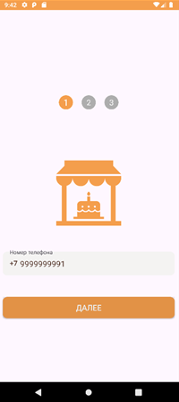
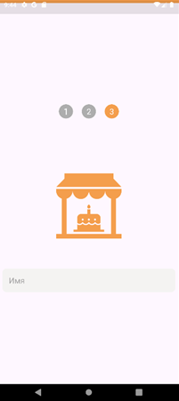
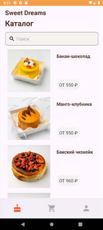
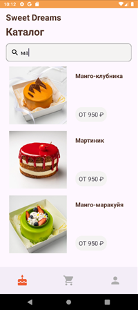
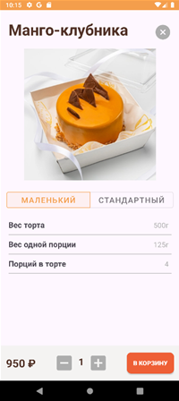

# SweetDream

Android-приложение для кондитерского магазина, разработанное на Java с использованием Firebase.

## О проекте

SweetDream позволяет пользователям просматривать каталог кондитерских изделий, искать товары, оформлять заказы и управлять своим профилем через удобный мобильный интерфейс.

Проект был разработан в рамках курсовой работы по дисциплине «Разработка мобильных приложений».

## Функциональность

* Авторизация и регистрация по номеру телефона (Firebase Authentication)
* Каталог кондитерских изделий
* Поиск товаров
* Просмотр подробной информации о товаре
* Добавление товаров в корзину
* Оформление заказов
* Просмотр истории заказов
* Профиль пользователя
* Загрузка фотографии профиля
* Хранение данных в Firebase Firestore
* Хранение изображений в Firebase Storage

## Технологии

* Java
* Android SDK
* Firebase Authentication
* Firebase Firestore
* Firebase Storage
* RecyclerView
* ViewBinding
* Glide
* Material Design

## Архитектура

Приложение построено на основе Activity и Fragment.

Основные модули:

* HomeFragment — каталог товаров
* CartFragment — корзина
* ProfileFragment — профиль пользователя
* OrdersFragment — история заказов
* DetailedActivity — карточка товара

## Запуск проекта

Для запуска необходимо:

1. Создать собственный проект в Firebase.
2. Добавить файл `google-services.json` в директорию `app/`.
3. Синхронизировать Gradle.
4. Запустить проект через Android Studio.

## Скриншоты

---

## Скриншоты

### Авторизация

| Телефон | SMS | Имя |
|----------|----------|----------|
|  |  |  |

### Каталог

| Каталог | Поиск |
|----------|----------|
|  |  |

### Карточка товара

### Профиль

### Корзина

| Корзина | Пустая корзина |
|----------|----------|
|  |  |

### Оформление заказа

## Автор

Еременко Анжелика
РТУ МИРЭА, направление «Программная инженерия».
